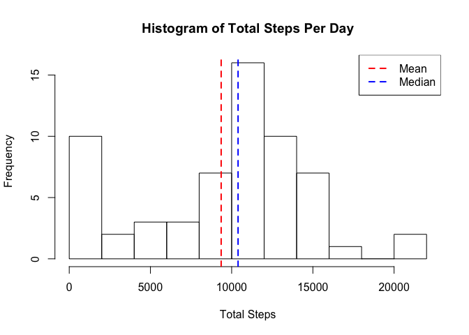
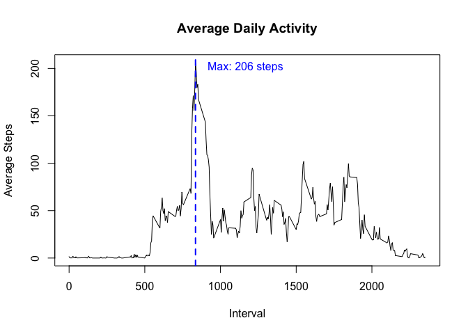
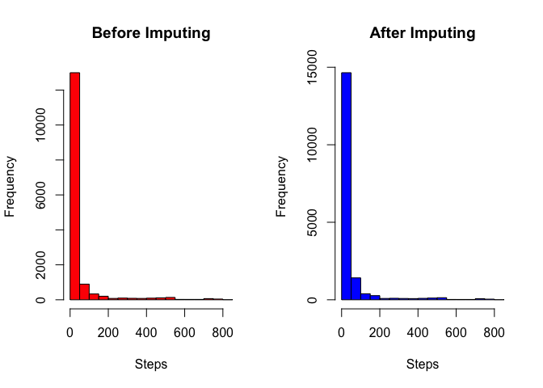
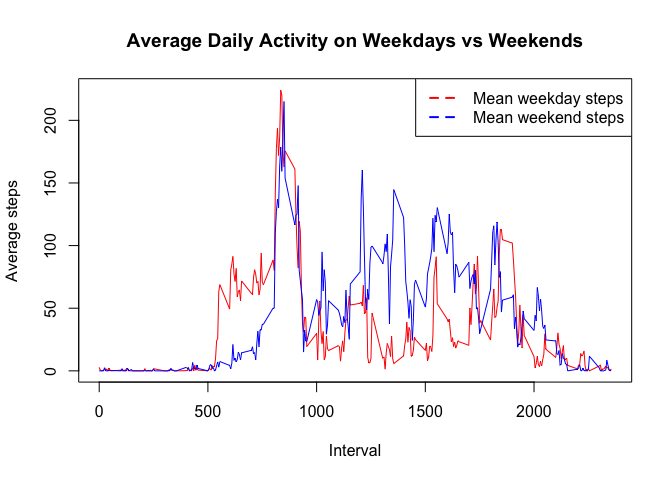

## Loading and preprocessing the data

```r
zip_file_name = "./activity.zip"

# Unzip data file
unzip(zip_file_name, exdir="./", overwrite=TRUE)
data <- read.csv("./activity.csv")
```


## What is mean total number of steps taken per day?

```r
# Load in dependencies
library(dplyr)
```

```
## 
## Attaching package: 'dplyr'
```

```
## The following objects are masked from 'package:stats':
## 
##     filter, lag
```

```
## The following objects are masked from 'package:base':
## 
##     intersect, setdiff, setequal, union
```

```r
library(ggplot2)

# Group up number of steps by day and calculate total number of steps per day
data_totals <-
  data %>%
  group_by(date) %>%
  summarise(total_steps=sum(steps, na.rm=TRUE))

# Calculate mean and median of total steps per day
mean_steps <- mean(data_totals$total_steps, na.rm=TRUE)
median_steps <- median(data_totals$total_steps, na.rm=TRUE)

# Make histogram of step totals
with(data_totals,
     hist(data_totals$total_steps, breaks=15,
          xlab="Total Steps", main="Histogram of Total Steps Per Day"))

# Plot vertical lines at mean and median
abline(v=mean_steps, col="red", lty=2, lwd=2)
abline(v=median_steps, col="blue", lty=2, lwd=2)

# Add a legend for the Veritcal lines
legend("topright", legend=c("Mean", "Median"),
       col=c("red", "blue"), lty=2, lwd=2)
```

<!-- -->

First I grouped the step numbers by the date using group_by and take the sum of the total steps on each day. I then use this to calculate the mean and median steps of each day. For this dataset the mean of the total steps for each day was 9354 and the median was 10395. When plotting the histogram I used 15 break points.

## What is the average daily activity pattern?

```r
# Calculate average number of steps at each interval point across all days
activity_avgs <-
  data %>%
  group_by(interval) %>%
  summarise(mean_steps = mean(steps, na.rm=TRUE))

# Find interval point that has max number of average steps
max_steps <- max(activity_avgs$mean_steps)
max_interval <- activity_avgs$interval[activity_avgs$mean_steps == max_steps]
msg <- paste("Max:", as.character(floor(max_steps)), "steps")

# Plot average steps 
with(activity_avgs,
     plot(interval, mean_steps, type="n",
          xlab="Interval", ylab="Average Steps"))

title(main="Average Daily Activity")
lines(activity_avgs$interval, activity_avgs$mean_steps)
abline(v=max_interval, col="blue", lty=2, lwd=2)
text(max_interval+330, max_steps-5, msg, col="blue")
```

<!-- -->

For this question I started by grouping by the interval for all dates in the dataset and took the mean of the steps at each interval across all dates. I then found the maximum average steps to be 206 at interval 835. I plotted the time series and added a vertical line at the interval that had the highest average steps.

## Imputing missing values

```r
library(impute)
library(reshape2)

# Get number of missing values in dataset
total_nas <- sum(is.na(data$steps))

# Get average for every interval in dataset
interval_avgs <- 
  data %>%
  group_by(interval) %>%
  summarize(mean_steps = mean(steps, na.rm=TRUE))

# Make temporary variable for imputed data
imputed_data <- data

# Replace intervals that have missing steps data with average
# Step number at that interval
for (i in 1:dim(data)[1]){
  if(is.na(imputed_data$steps[i])){
    # Get interval of missing row
    interval <- imputed_data$interval[i]
    # Get index in averages data frame
    index <- interval_avgs$interval==interval
    # Replace NA with average at that interval
    imputed_data$steps[i] = interval_avgs$mean_steps[index]
  }
}

# Plot histogram of dataset before and after imputing
par(mfrow=c(1,2))
hist(data$steps, main="Before Imputing", xlab="Steps", col="red")
hist(imputed_data$steps, main="After Imputing", xlab="Steps", col="blue")
```

<!-- -->

This dataset had a total of 2304 missing values. I chose to impute this missing data by replacing them with the average step number at the respective interval across all dates. To accomplish this, I grouped the dataset by its interval and took the mean of the steps at each interval. I then used a for loop to look through the steps column for missing values. When a missing value is found, it is replaced with the average value at the corresponding interval. I then plotted a histogram of the dataset before and after imputing.

## Are there differences in activity patterns between weekdays and weekends?

```r
library(lubridate)
```

```
## 
## Attaching package: 'lubridate'
```

```
## The following object is masked from 'package:base':
## 
##     date
```

```r
# Function that determines if date is a weekday or weekend
weekend_or_weekday <- function(xday){
  weekdays <- c(2,3,4,5)
  lub <- wday(ymd(xday))
  ifelse(lub %in% weekdays, "weekday", "weekend")
}

weekday_means <- 
  data %>%
  # Create new factor column that shows if date is a weekend or weekday
  mutate(weekday = weekend_or_weekday(date)) %>%
  mutate(weekday = as.factor(weekday)) %>%
  # Take mean steps of each interval on weekends and weekdays
  group_by(weekday, interval) %>%
  summarise(mean_steps = mean(steps, na.rm=TRUE))

# Cast to wide format of dataset to make plotting easier
weekday_activity <- dcast(weekday_means, interval~weekday, value.var="mean_steps")

# Plot data
with(weekday_activity, plot(interval, weekday, type="n",
                            ylab="Average steps", xlab="Interval"))

title(main="Average Daily Activity on Weekdays vs Weekends")

lines(weekday_activity$interval, weekday_activity$weekday, col="red")
lines(weekday_activity$interval, weekday_activity$weekend, col="blue")

legend("topright", legend=c("Mean weekday steps", "Mean weekend steps"),
       col=c("red", "blue"), lty=2, lwd=2)
```

<!-- -->

To find the weekend/weekday differences I started by using a lubridate function to determine which dates in the dataset were weekdays or weekends. I then group by weekdays and intervals and calculate the means of those groups and plotted the mean number of steps at each interval for weekdays and weekends
